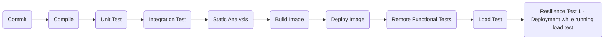

[](https://github.com/Tyagi-Gaurav/Movie/actions/workflows/functionalTest.yml)
[](https://github.com/Tyagi-Gaurav/Movie/actions/workflows/sonar.yml)
[](https://sonarcloud.io/summary/new_code?id=Tyagi-Gaurav_Movie)
[](https://sonarcloud.io/summary/new_code?id=Tyagi-Gaurav_Movie)
[](https://sonarcloud.io/summary/new_code?id=Tyagi-Gaurav_Movie)
[](https://sonarcloud.io/summary/new_code?id=Tyagi-Gaurav_Movie)
[](https://sonarcloud.io/summary/new_code?id=Tyagi-Gaurav_Movie)

## Movie API

# Content Upload Swagger
```
http://localhost:9090/api/webjars/swagger-ui/index.html
```
# Content Upload json Export:
```
http://localhost:8080/content/upload/api/v3/api-docs
```

# Accessing Application Config
```
http://localhost:8080/content/upload/actuator/config
http://localhost:8080/user/private/config
```

### Engineering Principles

<table>
    <thead>
        <tr>
            <th></th>
            <th>Content-Upload</th>
            <th>User</th>
            <th>Issue#</th>
        </tr>
    </thead>
    <tbody>
        <tr>
            <td>Clearly documented interfaces</td>
            <td>(x)</td>
            <td>(x)</td>
            <td>https://github.com/Tyagi-Gaurav/Movie/issues/212</td>
        </tr>
        <tr rowspan="2">
            <td>
                    Resilience libraries configured for any downstream<br>
                    <li>Circuit breaker correctly configured for downstreams</li>
                    <li>Timeouts for downstreams</li>
                    <li>Bulkhead per endpoint</li>
                    <li>GRPC/HTTP Client timeout</li>
            </td>
            <td>(x)</td>
            <td>(x)</td>
            <td>https://github.com/Tyagi-Gaurav/Movie/issues/194</td>
        </tr>
        <tr>
            <td>Intra service communication via GRPC</td>
            <td>(x)</td>
            <td>NA</td>
            <td></td>
        </tr>
        <tr>
            <td>Public API only accessible on HTTPS</td>
            <td>(x)</td>
            <td>(x)</td>
            <td></td>
        </tr>
        <tr>
            <td>All Public API only accessible via API gateway</td>
            <td>(x)</td>
            <td>(x)</td>
            <td></td>
        </tr>
        <tr>
           <td>Healthcheck, Liveness Checks & Raediness Checks</td>
            <td>(x)</td>
            <td>(x)</td>
            <td>https://github.com/Tyagi-Gaurav/Movie/issues/296</td>
        </tr>
        <tr>
            <td>Application should shutdown gracefully</td>
            <td>(x)</td>
            <td>(x)</td>
            <td>https://github.com/Tyagi-Gaurav/Movie/issues/159</td>
        </tr>
        <tr>
            <td>
                    Metrics Available for<br>
                    <li>Number of Incoming Requests</li>
                    <li>Number of Outgoing Requests by Upstream</li>
                    <li>Latency of Upstream Responses</li>
                    <li>Latency of Application</li>
                    <li>CPU</li>
                    <li>Memory</li>
                    <li>Disk Space</li>
                    <li>JVM Heap Usage</li>
                    <li>JVM GC Cycles</li>
                    <li>Circuit breaker Stats - Queue Size</li>
                    <li>Error Count by Code</li>
                <li>Database Call Latency</li>
            </td>
            <td>(x)</td>
            <td>(x)</td>
            <td></td>
        </tr>
        <tr>
            <td>Ensure Sensitive fields are not printed to Console or logs. Eg. PII, Password, Secrets etc.</td>
            <td>(x)</td>
            <td>(x)</td>
            <td></td>
        </tr>
        <tr>
            <td>SLO documented for all services</td>
            <td>(x)</td>
            <td>(x)</td>
            <td>(Can do as part of load test)</td>
        </tr>
        
    </tbody>
</table>

### Pipeline Structure


### Components Functionality/Responsibility

#### Content Upload
* All users to upload movie, its ratings and streams associated with the movie
* Tech Stack
    * Java 17
    * Spring WebFlux 
    * MySQL

#### User
* API Users must be able to create an account and log in.
* Authenticate all API calls.
* Helps issue authentication tokens to clients and validate them.
* There are two roles with different permission levels:
    * A regular user that can only access their own records.
    * An admin that can CRUD all users and all user records.
* Tech Stack
    * Java 17
    * Vertx 
    * PostGres

#### API Gateway
* Nginx based API gateway
* Requests to all applications are sent via this component.
* Provides routes that are accessible via clients

#### Application Security

To access the application, users need a valid `userId` and `password` to login. Once they login, they would be provided
a security token ([JWT](https://jwt.io/))

### User Registration with Google, Github credentials
The application also supports login to App via Google and Github credentials. When the `ui` container
is running locally, the page can be accessed via 
```
http://localhost:8080/ui/index.html
```

### Testing

There are three categories of tests available to execute.

* Unit tests: These are a set of fast running tests that usually finish within a minute. They  can be triggered using 
  the following command.

```
./gradlew clean check
```

* Integration tests: These are a set of slow running tests that spin up the entire application in memory before running
the tests. They can be triggered separately using.
```
./gradlew clean integrationTest
```

* Functional tests: The functional tests verify correctness of the application as a black box. Hence, they need the
  application to be running before they can be triggered.
    - To start the application, run the following command.
      ```
      ./gradlew clean build bootRun
      ```
      or spin up the docker compose stack
      ```
      docker-compose up -d --build
      ```

    - Once the application is running, the functional tests can be triggered using the following command.
      ```
      ./gradlew remoteFunctional
      ```

A code coverage plugin [Jacoco](https://www.jacoco.org/jacoco/") has been added to the project in order to keep the test
coverage in check. This plugin would automatically run whenever the unit tests are executed. The plugin generates an
HTML report that can be found at the following path.

```
application/build/jacocoHtml/index.html
```

In order to run [Jacoco](https://www.jacoco.org/jacoco/") separately, it can be triggered using the following command.

```
./gradlew application:jacocoTestReport
```

### Postman Collection

A postman collection has been added to the project if you need a more user-friendly way to explore the APIs of the
application. It can be found at the root directory of the project by the name of `MovieAPI.postman_collection.json`

### Starting the application

The application can either be started in Standalone mode where everything runs in-memory or in the non-standalone mode
where it could run inside a docker container.

* To start the application in standalone mode, use the following command. By default, this would start the application
  on port 8080. Refer the [Configuration](#configuration) section, if you would like to switch to a different port.

```
./gradlew clean build bootRun 
```

* To start the application in non-standalone mode, a [Docker Compose](https://docs.docker.com/compose/") file has been
  provided that contains configuration for two containers. The first container is for the application, while the other
  is for database ([Redis](https://redislabs.com/)). Docker compose can be started using the following command, however
  as a prerequisite it will require installation of Docker and Docker Compose on the host. Refer the website
  of [docker](https://docs.docker.com) for details.

```
docker-compose up -d --build
```

### Stopping the application

In standalone mode, the application can be stopped by pressing `Ctrl-C`. This would send a `SIGTERM` to the application
that would terminate it gracefully. For application, running in docker container, use `docker stop <container_name>` or
spin down the docker compose stack.

### Observability

Once the application is running, it's important to be able to monitor the operations of the application. The following
options are available monitor the application state.

#### `status` endpoint

This endpoint would help to determine if the application is available to serve its users. If the application is able to
serve its users, it would return an HTTP status code of 200 with a text of "OK" as the response.

#### Logging

The application employs [SLF4J](http://www.slf4j.org/) api for logging. The properties for that can be found
under `application/src/main/resources`. The default logging level has been set to `INFO`.

#### Request-ID

For every request, the application assigns a unique request-ID and attaches it the request and response header. The
request-ID appears alongside each log statement of the transaction and is also returned as part of the response. This
should simplify any kind of request tracing that me be needed to perform.

#### Call Duration

For every request, the application also logs the total time it took for application to perform the operation. This time
is also recorded into a histogram for easier analysis.

#### `metrics` endpoint

JVM metrics can be accessed using an endpoint provided in the application. This would provide JVM metrics and all the
other functional metrics provided in the application. The following metrics are available

- `request_latency` is a histogram to analyse endpoints latency.
- `request_count` is a counter to record request counts for a given HTTP method and path.
- `exceptionCount` ia a counter to provide the number of exceptions occurred by HTTP status code.

The metrics endpoint can be accessed via the management port of the application. When running the app locally the URL
would be `http://localhost:8081/actuator/metrics`. This would return a list of metric names.

To get details on an individual metric, we could use `http://localhost:8081/actuator/metrics/<metricName>`.

### Execution Environment

The application runs on [Java 17](https://docs.oracle.com/en/java/javase/17/docs/api/index.html) which means that for
application in standalone mode, it would need a Java installation. The application does not do that by itself.

For non-standalone mode, it just needs docker host and docker compose installations mentioned above.

### Some Application HowTo's
[How do I?](./HowTo.MD#How do I?)
