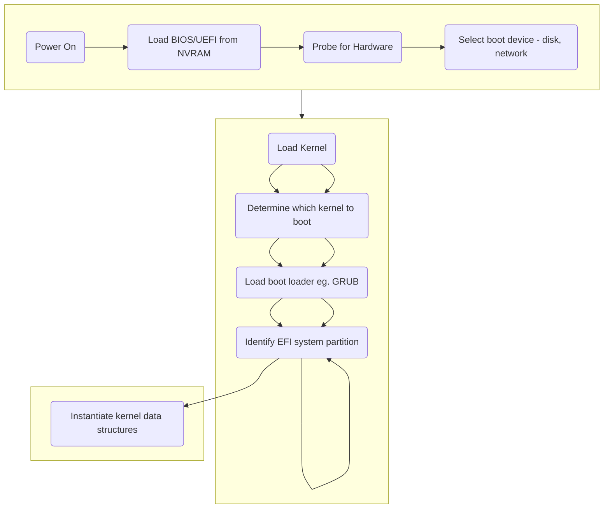

# Linux Distributions
* A Linux distribution comprises the Linux kernel, which is the core of the operating system, and packages that make up all the commands you can run on the system
* All distributions share the same kernel lineage, but the format, type, and number of packages differ quite a bit.
* Ex. Ubuntu, which is based on debian.
* Two versions of Ubuntu are released annually: one in April and one in October. 
  * The April releases in even-numbered years are long-term support (LTS) editions that promise five years of 
  maintenance updates. 
  * These are the releases recommended for production use.
* Red Hat Enterprise Linux, often shortened to RHEL, targets production environments at large enterprises that 
  require support and consulting services to keep their systems running smoothly.
* Somewhat paradoxically, RHEL is open source but requires a license. 
  * If you’re not willing to pay for the license, you’re not going to be running Red Hat. 
  * Red Hat also sponsors Fedora, a community-based distribution that serves as an incubator for bleeding-edge 
  software not considered stable enough for RHEL. 
  * Fedora is used as the initial test bed for software and configurations that later find their way to RHEL.

# Unix Distributions
* Eg. Solaris, HP-UX, AIX, FreeBSD.
* Some of the world’s foremost operating system authorities rely on the various BSD distributions.
  * Apple’s macOS has a BSD heritage.
* Unlike Linux, FreeBSD is a complete operating system, not just a kernel

# Booting
  * In later stages, most Linux distributions now use a system manager daemon called `systemd` instead of the traditional UNIX `init`.
  * `systemd` streamlines the boot process by adding dependency management, support for concurrent startup processes, and a comprehensive approach to logging, among other features.

